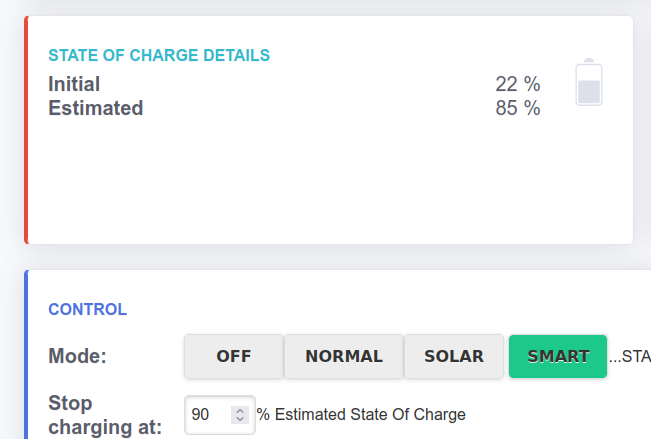
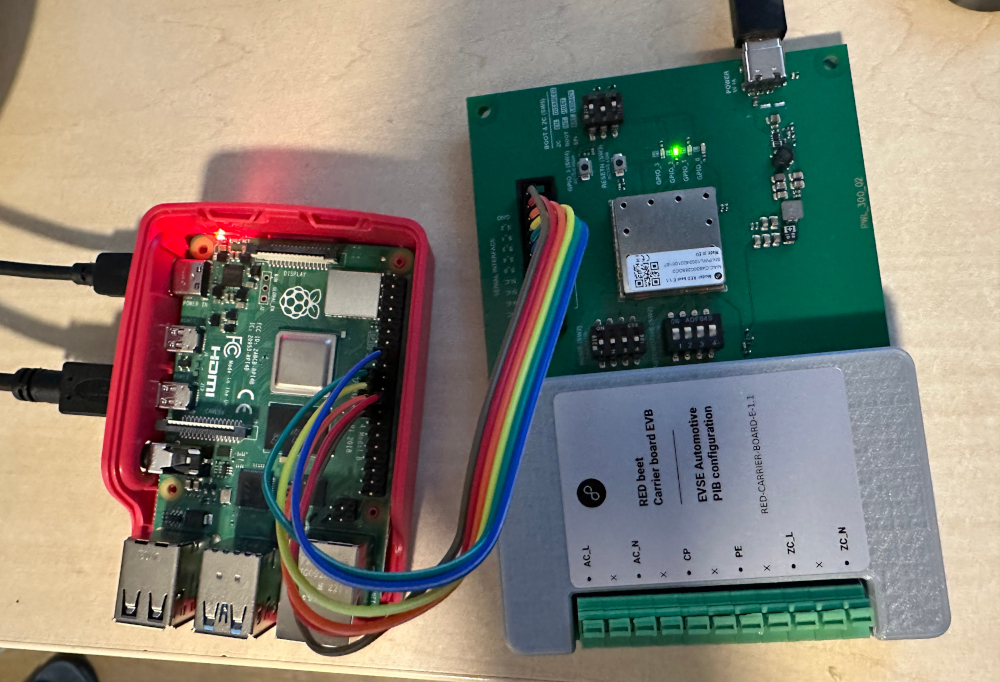
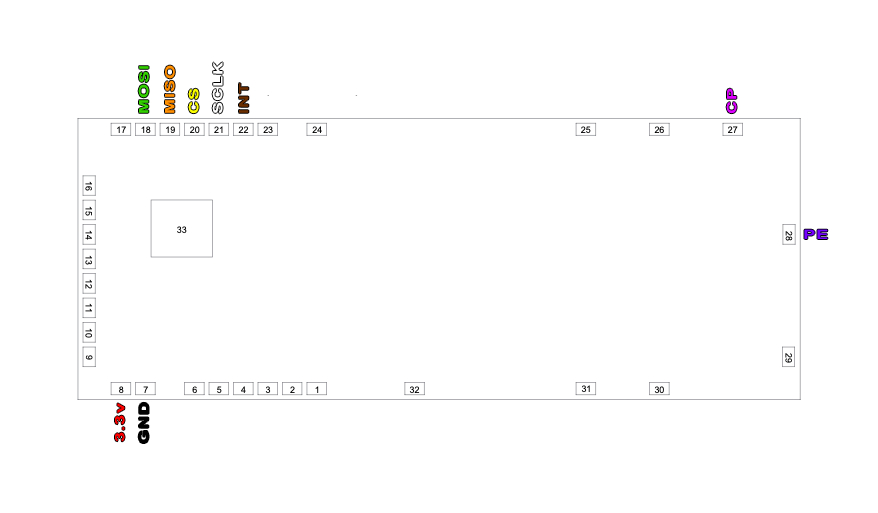
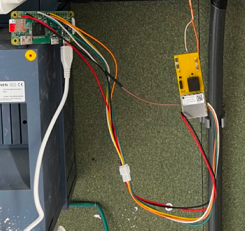
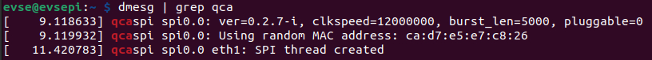
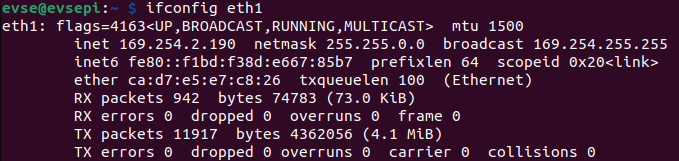

# Vehicle communication feature using Modem

Custodian: A.J. Kramer
Date: June 09, 2023

When you connect your car to a public charger,
in particular DC fast chargers or chargers made by Alfen,
the charger is able to show the State of Charge on the display.
Some chargers even are able to recognize the car, and authorize billing automatically;
for example Fastned with its Autocharge feature.

Those chargers are able to extract this information using the
HomePlug Green Phy standard (ISO15118) and a compatible modem.
In a nutshell, these modems work similar to powerline ethernet adapters,
but in this case the communication happens over the CP line between EVSE and car.



## Step 1: Hardware

Without hardware there is no means to communicate.
Currently, only a Raspberry PI (or equivalent) together with a QCA7000x modems
have been tested, but modified HomePlug adapters can also work.

There are two components to buy:

1. Raspberry PI: Pi Zero W and Raspberry Pi 4 have been confirmed to work
2. Modem hardware

### Modem option 1: Dev board (no soldering)

This approach is the easiest, but is a fair bit more expensive than others.
The hardware used is the "RED / YELLOW beet Carrier board EVB 1.1 (EVSE)".

- Seller: https://www.codico.com/en/red-carrier-board-e-1-1-evse

- Datasheet:
  https://www.8devices.com/media/products/redbeet/downloads/8devices_carrier_board_h_datasheet_rev.1.04_20201211_604919_7.pdf

You also need some male-female DuPont wires.

The datasheet lays out the wiring diagram, which is the following:

| CARRIER board 2x10 pin connector | Raspberry Pi 2x20 pin GPIO connector |
|----------------------------------|--------------------------------------|
| 1 (GND)                          | 25                                   |
| 3 (SPI_CS)                       | 24                                   |
| 5 (SCLK)                         | 23                                   |
| 7 (MISO)                         | 21                                   |
| 9 (MOSI)                         | 19                                   |
| 11 (INTR)                        | 16                                   |

Your result should look like this:



On the green connector,
make sure you branch of the CP line between the car and SmartEVSE.
Both the car, SmartEVSE and modem should be connected to the same CP signal.
Also, the PE pin (earth wire) needs to be connected.
All the other lines, like AC and ZC are not needed.

The dev board also needs to be supplied with power. You can use a USB-C charging cable
for this, connected to the PI. You can also use a normal USB-C charger.

### Modem option 2: Yellow Beet (a bit of soldering)

This option is much cheaper than a developer board, but it requires a bit of soldering.

- Seller: https://www.codico.com/en/yellow-beet-e-1-1

- Datasheet:
  https://www.8devices.com/media/products/redbeet/downloads/YELLOW_beet_datasheet_rev.1.17_20200703.pdf

The datasheet lays out the wiring diagram, which is the following:



| Yellow beet pads | Raspberry Pi 2x20 pin GPIO connector |
|------------------|--------------------------------------|
| 7 (GND)          | 25                                   |
| 8 (3.3V)         | 1                                    |
| 20 (SPI_CS)      | 24                                   |
| 21 (SCLK)        | 23                                   |
| 19 (MISO)        | 21                                   |
| 18 (MOSI)        | 19                                   |
| 22 (INTR)        | 16                                   |

Also, solder the CP and PE lines, and branch them into the CP and PE lines 
of the SmartEVSE. Both the car, SmartEVSE and modem should be connected to the same CP signal.

After soldering, your product might look like this:



The orange wires at the top are the CP and PE lines.

### Modem option 3: Modifying HomePlug Adapter

Not tested in this project, but it is documented to work in pyPLC repo:
https://github.com/uhi22/pyPLC/blob/master/doc/hardware.md

# Software

## Use the right distribution of SmartEVSE software
You should use the serkri distribution of SmartEVSE.
This fork has many more features than the vanilla one, and includes the modem feature.

## Enable the Raspberry PI drivers
Edit your config.txt of your raspberry pi, and add the following at the end:
You can find config.txt in the `/boot` folder.

```text
dtoverlay -h qca7000
```

And reboot. 

Verify if the QCA7000/5 driver probe was successful with the command:
```bash
dmesg | grep qca
```



As seen in the log, it should have created a new ethernet port, eth1:

```bash
ifconfig eth1
```



## Install pyPLC
Please follow these instructions, including the sudo-less run of pyPLC:

https://github.com/uhi22/pyPLC/blob/master/doc/installation_on_raspberry.md

In this case however, we're interested in running pyPLC in EVSE mode.
Rename the `pev.service` to `pyPLC.service`, and replace with following:

```text
[Unit]
Description=pyPLC
After=network.target

[Service]
Environment="PYTHONUNBUFFERED=1"
ExecStart=/usr/bin/python3.9 /home/evse/pyPLC/evseNoGui.py
WorkingDirectory=/home/evse/pyPLC
KillMode=process
Restart=on-failure
User=evse
Group=evse

[Install]
WantedBy=multi-user.target
Alias=pyplc.service
```

Adjust the user and group to your username. On default, `pi` and `pi`.
Adjust the python executable path (in example `/usr/bin/python3.9` to the one found in the Sudo-less configuration).
Adjust the path of the `evseNoGui.py`, in this example it's `/home/evse/pyPLC/evseNoGui.py`
Adjust the working directory as well.

Now reload the systemd services:
```bash
systemctl daemon-reload
```

This should look fine. 

## Configure pyPLC.ini
As mentioned in the guide of pyPLC, you should have copied the pyPLC.ini from a template.
If not, do that as mentioned in the linked guide above. 

Edit the pyPLC.ini.

Set `soc_callback_enabled` to `True`, 
and set `soc_callback_endpoint` to the base URL of the SmartEVSE. 
Do not leave a trailing slash. Example: `http://10.0.0.1`

Set `testsuite_enable` to `No`, this is not what you want during deployment.
Set `eth_interface` to `eth1`.
Set `mode` to `EvseMode`.

```bash
systemctl start pyplc
```

You can also enable auto-start, so it will start along with your pi:

```bash
systemctl enable pyplc
```

Check the output using journalctl:

```bash
journalctl -u pyplc -f --no-tail
```

# Test it
On the SmartEVSE, go to the menu and set `Modem` to `Experimental`.

Now, with your eyes on the log of journalctl, plug your car in the charger.
At some point you should see messages racing by in the log; including SoC messages.

If configured appropriately, you should see the results in the web-ui of SmartEVSE.

Congratulations 🎉